## 🥬 목차

- [1️⃣ 서비스 소개](#-서비스-소개)
- [2️⃣ 팀원 소개](#-팀원-소개)
- [3️⃣ 기술 스택](#-기술-스택)
- [4️⃣ 시스템 아키텍처](#-시스템-아키텍처)

  

## 🥬 서비스 소개
### 가볍게 소통하는 창구 목적의 커뮤니티 프로젝트입니다.

- 🕜 **진행 기간** : 2025.09.10. ~ 2025.12.7.
- 👨‍👩‍👧‍👦 **진행 인원** : 1명

| <a href="https://github.com/100-hours-a-week/3-luke-han-community-BE">Backend-Repository</a>

 

## 서비스 화면

`홈`
|로그인|회원가입|
|---|---|
|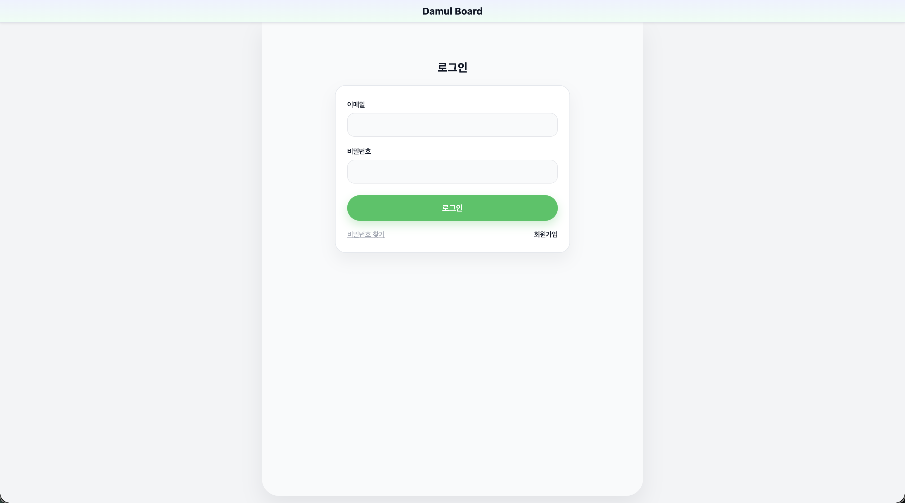|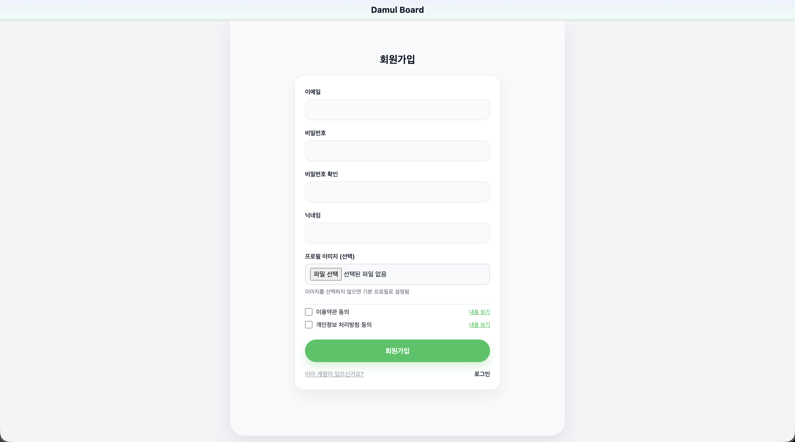|

`게시글 목록`
|전체 게시글|
|---|
|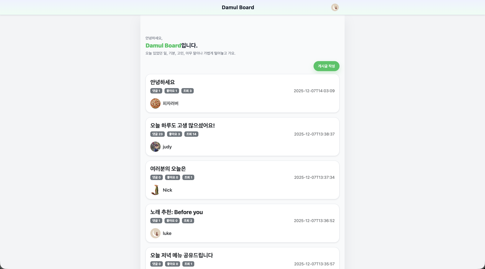|

`게시물 작성 / 상세 / 수정 / 삭제`

|게시물 작성|게시물 상세|게시글 수정|게시글 삭제|
|---|---|---|---|
|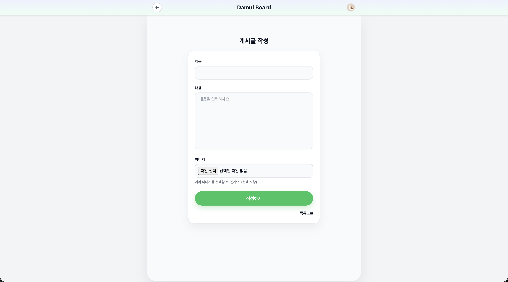|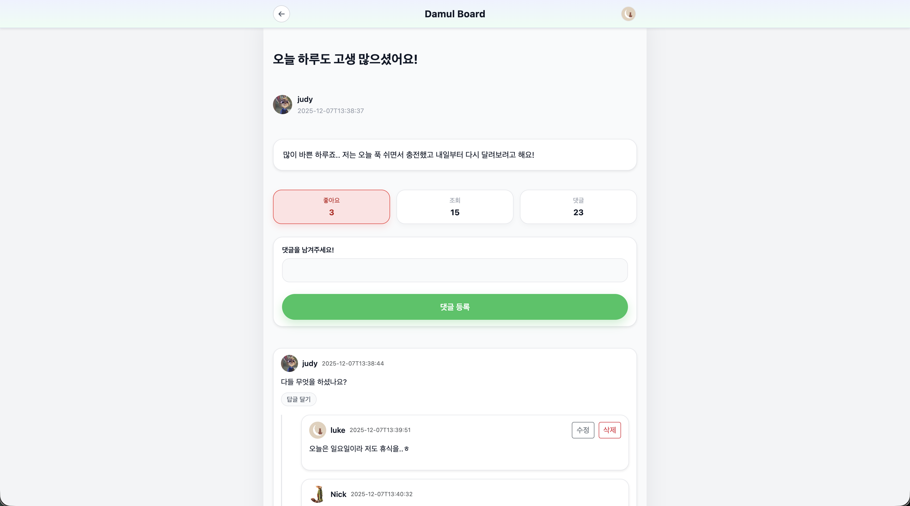|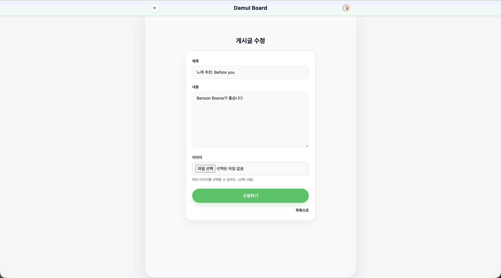|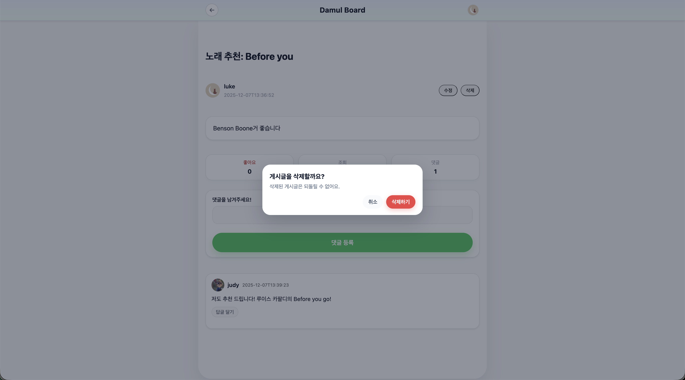|

`댓글 목록 / 등록 / 수정 /삭제`

|댓글 목록|댓글 등록|댓글 수정|댓글 삭제|
|---|---|---|---|
|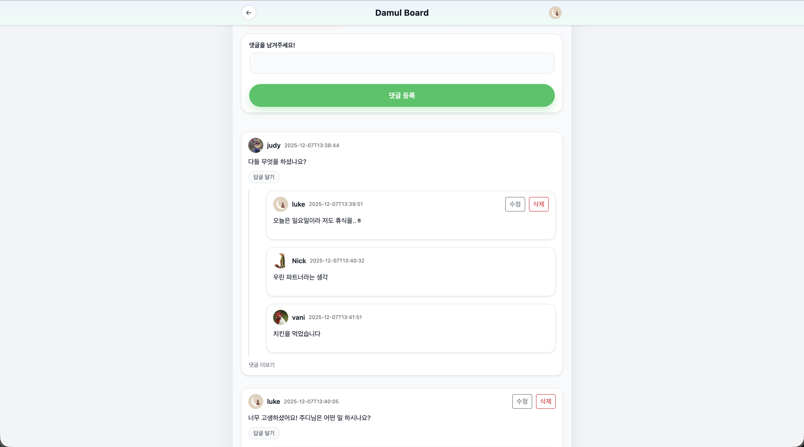|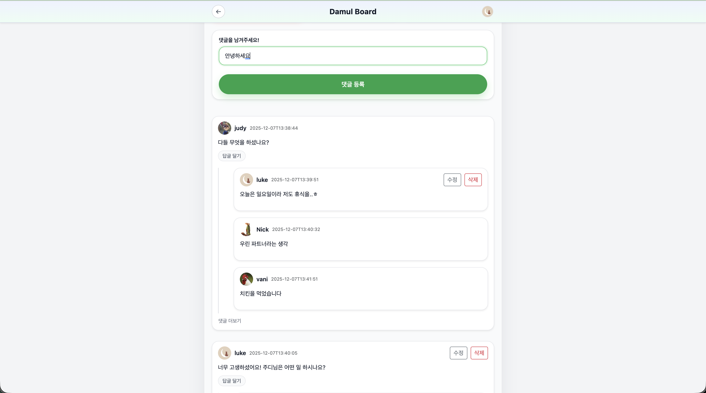|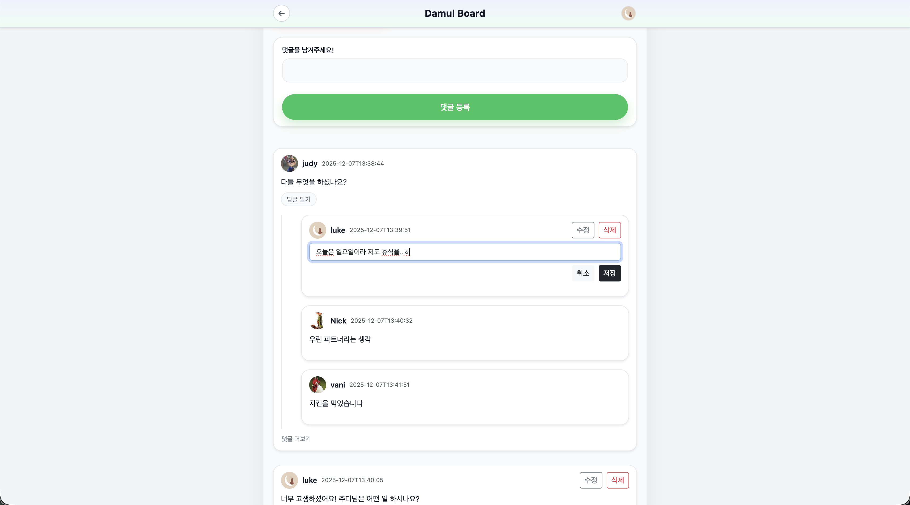|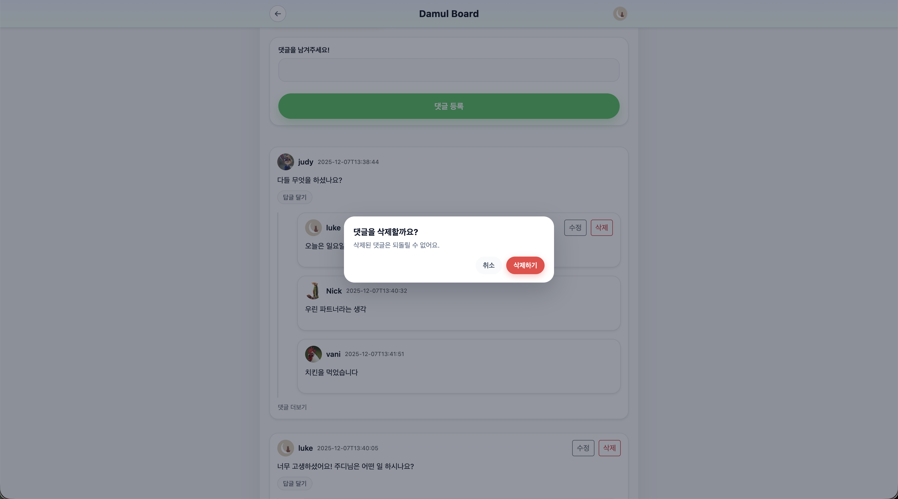|
  
`프로필 수정 / 비밀번호 수정 / 회원 탈퇴 / 로그아웃`

|프로필 수정|비밀번호 수정|
|---|---|
|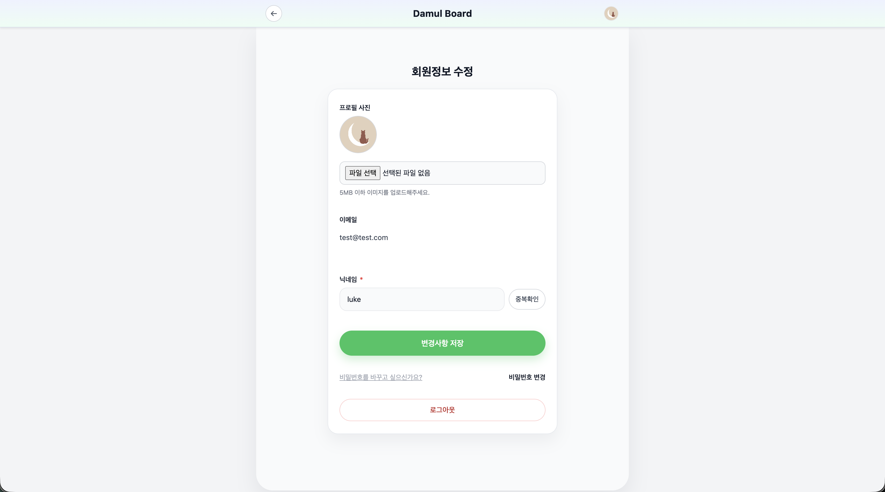|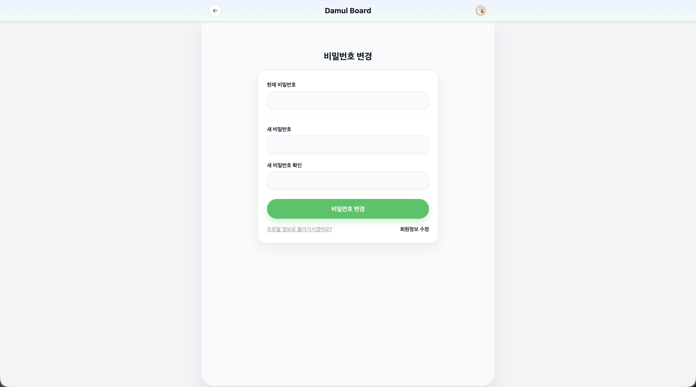|
  

## 🥬 팀원 소개
<table>
  <tr>
    <td align="center"><a href="https://github.com/rpeowiqu"> <b>한재서</b></a> 프론트엔드 </td>
  </tr>
</table>

  

## 🥬 기술 스택

<table>
<tr>
    <td align="center">프론트엔드</td>
    <td>
      
    </td>
  </tr>
  <tr>
    <td align="center">인프라</td>
    <td>
      
      
    </td>
  </tr>
</table>

  

## 🥬 시스템 아키텍처

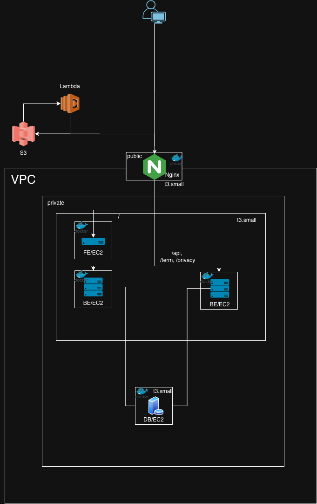

  

### 시연 영상

